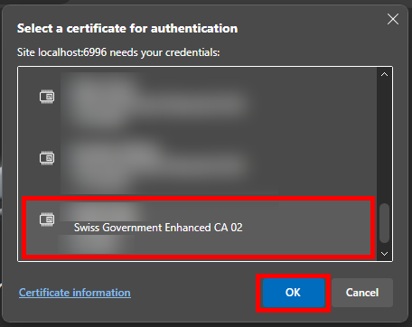
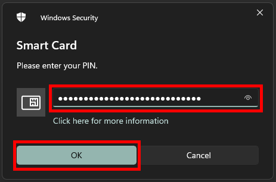
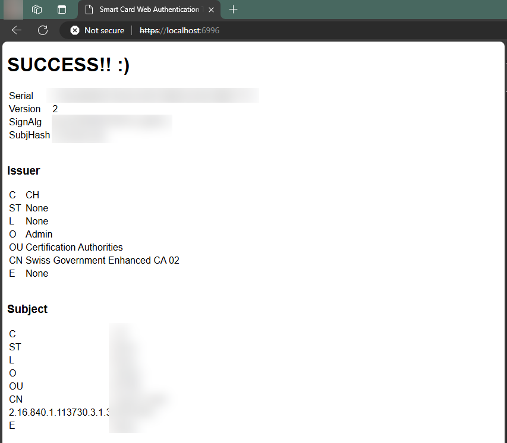
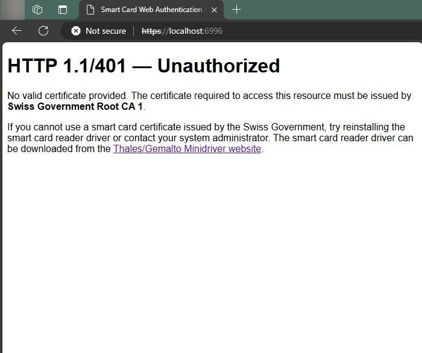

# Smartcard-based web authentication using Python/Flask
This is a demo server. **It will only work with smart-cards isseud by the Swiss Government.**

Only minor modifications are necessary for this project to work with other smart-cards:

1. Replace `<project-root>/cert/swissgov-root-ca1.p7b` with the issuing root certificate.
2. Replace `<project-root>/cert/swissgov-enhanced-ca02.p7b` with the issuing certificate chain. This file may also be identical to `<project-root>/cert/swissgov-root-ca1.p7b`.
3. Change the following lines in `<project-root>/server.py` if needed:
    ```diff
    - CERTIFICATE_CLIENT_ROOT_P7B : str = f'{CERTIFICATE_DIR}/swissgov-root-ca1.p7b'
    + CERTIFICATE_CLIENT_ROOT_P7B : str = f'{CERTIFICATE_DIR}/your-certificate-root.p7b'
    CERTIFICATE_CLIENT_ROOT_PEM : str = CERTIFICATE_CLIENT_ROOT_P7B[:-4] + '.pem'
    - CERTIFICATE_CLIENT_KEYCHAIN_P7B : str = f'{CERTIFICATE_DIR}/swissgov-enhanced-ca02.p7b'
    + CERTIFICATE_CLIENT_KEYCHAIN_P7B : str = f'{CERTIFICATE_DIR}/your-certificate-chain.p7b'
    CERTIFICATE_CLIENT_KEYCHAIN_PEM : str = CERTIFICATE_CLIENT_KEYCHAIN_P7B[:-4] + '.pem'
    ```
4. Note that you can also exclusively use the `.pem` format instead of `.p7b`, but that would require also removing the following lines:
    ```diff
    - if not(os.path.exists(CERTIFICATE_CLIENT_ROOT_PEM)):
    -     convert_p7b_to_pem(CERTIFICATE_CLIENT_ROOT_P7B, CERTIFICATE_CLIENT_ROOT_PEM)
    -
    - if not(os.path.exists(CERTIFICATE_CLIENT_KEYCHAIN_PEM)):
    -     convert_p7b_to_pem(CERTIFICATE_CLIENT_KEYCHAIN_P7B, CERTIFICATE_CLIENT_KEYCHAIN_PEM)
    ```

## Instructions

1. Clone this repo
2. Run
    ```bash
    pip install pyopenssl werkzeug flask
    ```
3. Run
    ```bash
    python server.py
    ```
4. Navigate to `https://localhost:6996/`
5. Connect your smart-card issued by the Swiss Government.
6. Select the smart-card certificate you want to use for the authentication:<br/>
    
8. Enter your PIN:<br/>
    
9. Success.<br/>
    
10. If unsuccessful, the following message is displayed:<br/>
    